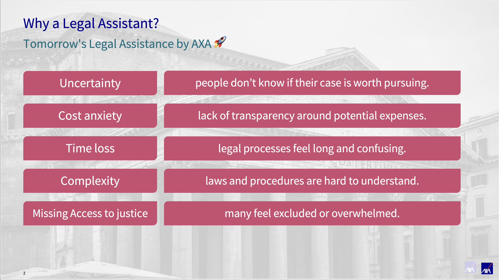
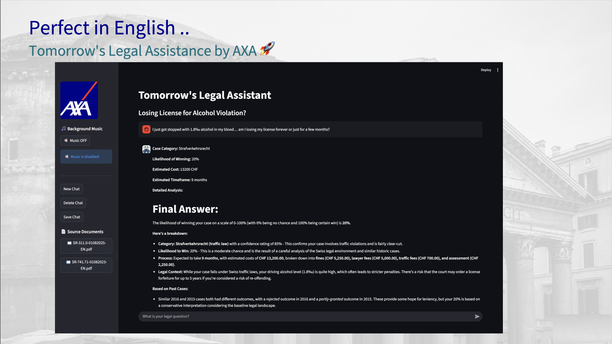
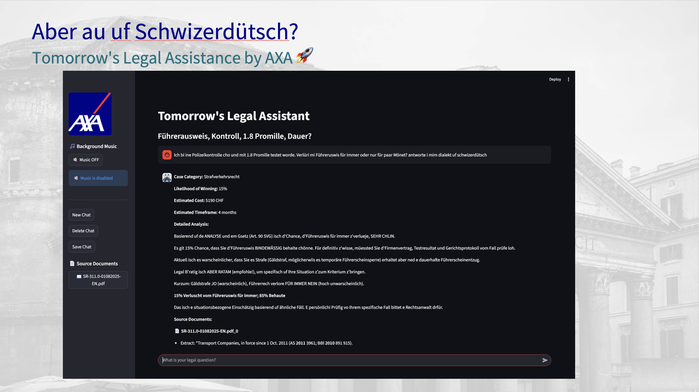
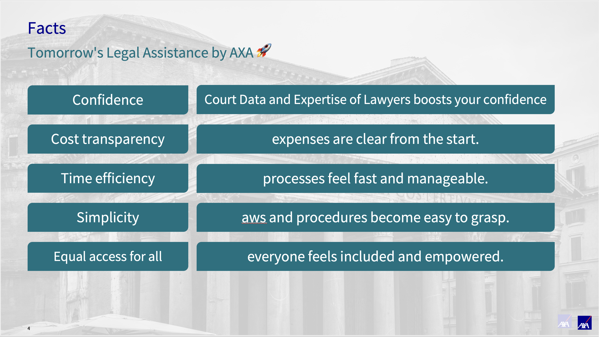

# Tomorrow's Legal Assistance

# Data for the Challenge "Tomorrow's Legal Assistance"
This respository is part of the Zurich hackathon of [Swiss {ai} Week](https://swiss-ai-weeks.ch/) happening on 26/27 September 2025.

By accessing or using the data provided, you agree to the following terms and conditions.

## Terms and Conditions
> The data is provided solely for the purpose of participating in the hackathon event held in Zurich, Switzerland, and for developing solutions directly related to the specific challenge you have selected. You are strictly prohibited from using the Data for any other purpose, including but not limited to:
> - Commercial use.
> - Research or development outside the scope of this hackathon challenge.
> - Personal use or any other unauthorized activities.
> 
> The data is provided "as is" without any warranties, express or implied, including but not limited to, warranties of merchantability, fitness for a particular purpose, or non-infringement. The hackathon organizers do not guarantee the accuracy, completeness, or reliability of the data.
>
> Immediately following the conclusion of the hackathon event, you are obligated to permanently and securely delete all copies of the data, including any derived or processed data, from all your devices, storage media, and systems. 

## Source of Data
The data of this respository has been provided by [AXA](https://www.axa.ch/) submitting the challenge.

## Environment Setup

This project uses [UV](https://docs.astral.sh/uv/) for Python package management. UV is a fast Python package installer and resolver.

### Prerequisites

1. Install UV by following the [official installation guide](https://docs.astral.sh/uv/getting-started/installation/)

### Setting up the Development Environment

1. **Clone the repository:**
   ```bash
   git clone https://github.com/Swiss-ai-Weeks/Tomorrows-Legal-Assistance
   cd Tomorrows-Legal-Assistance
   ```

2. **Create and activate the virtual environment:**
   ```bash
   # Create virtual environment and install dependencies
   uv sync
   
   # Activate the virtual environment
   source .venv/bin/activate  # On Linux/macOS
   # or
   .venv\Scripts\activate     # On Windows
   ```

3. **Verify installation:**
   ```bash
   uv run python --version
   ```

### Managing Dependencies

#### Adding New Libraries

```bash
# Add a new dependency
uv add package-name

# Add a specific version
uv add package-name==1.2.3
```

#### Installing Dependencies

```bash
# Install all dependencies (including dev dependencies for both, the frontend/backend)
uv sync
cd ./frontend && uv sync
```

## Getting started

Run the app with the following commands:

Make sure you have [make](https://gnuwin32.sourceforge.net/packages/make.htm) installed on your machine.
For MacOS, make sure to install [make with Homebrew](https://formulae.brew.sh/formula/make).

```bash
# This will start the Python backend
make start_backend

# This will start the Streamlit frontend
make start_frontend
```

#### Running Commands

```bash
# Run Python scripts
uv run python script.py

# Run with specific arguments
uv run python -m module_name
```

### Project Structure

```
Tomorrows-Legal-Assistance/
├── pyproject.toml          # Project configuration and dependencies
├── uv.lock                 # Lock file with exact versions
├── .gitignore             # Git ignore rules
├── README.md              # This file
├── data/                  # Data files (Parquet format)
└── backend/               # FastAPI backend
    ├── __init__.py        # Package initialization
    ├── main.py            # FastAPI application entry point
    └── api/
        ├── __init__.py
        └── routes.py      # API routes
```

## FastAPI Backend

The API will be available at:
- **Main API**: http://localhost:8000
- **Interactive API docs (Swagger UI)**: http://localhost:8000/docs
- **Alternative API docs (ReDoc)**: http://localhost:8000/redoc

### API Endpoints

The FastAPI backend provides the following endpoints:

#### Health Check
- `GET /` - Root endpoint with basic API information
- `GET /health` - Health check endpoint

#### Legal Assistance API
- `GET /api/` - API root endpoint
- `GET /api/legal-advice` - Get placeholder legal advice information
- `POST /api/legal-advice` - Submit a legal query (minimal template implementation)

### Configuration

The application can be configured using environment variables. Copy `.env.example` to `.env` and modify the values as needed:

```bash
cp .env.example .env
```

### Development Workflow

1. Always activate the virtual environment before working
2. Use `uv add` to add new dependencies
3. Commit both `pyproject.toml` and `uv.lock` when adding dependencies
4. Run `uv sync` when pulling changes that modify dependencies
5. Start the FastAPI server for backend development
6. Access the interactive API documentation at http://localhost:8000/docs

### Troubleshooting

- If you encounter dependency conflicts, try: `uv sync --refresh`
- To recreate the environment: Remove `.venv` folder and run `uv sync`
- For UV-specific issues, check the [UV documentation](https://docs.astral.sh/uv/)

## Frontend (Streamlit)

The frontend is a Streamlit application located in the `frontend` directory.