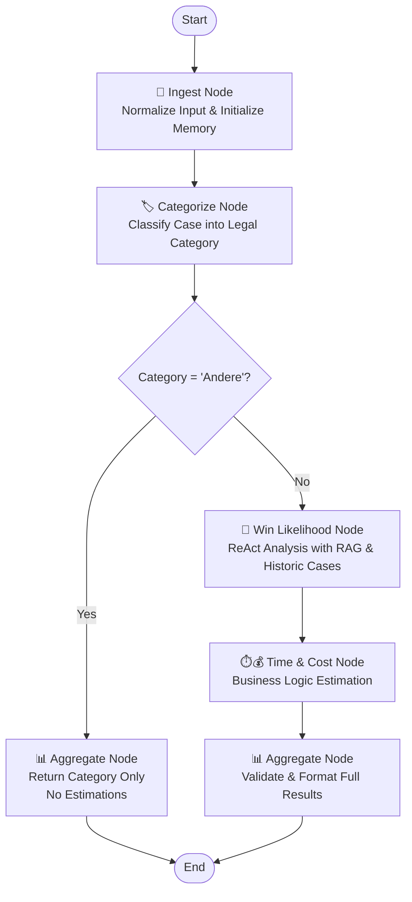

# Swiss Legal Case Analysis Agent

A LangGraph-based ReAct agent for analyzing Swiss legal cases. This agent ingests case descriptions and provides comprehensive analysis including case classification, win likelihood estimation, and time/cost projections.

## Features

- **Case Classification**: Automatically categorizes cases into: Arbeitsrecht, Immobilienrecht, Strafverkehrsrecht, or Andere
- **Win Likelihood Analysis**: Uses RAG retrieval of Swiss law and historic cases to estimate success probability (1-100)
- **Time & Cost Estimation**: Provides realistic time estimates and cost breakdowns  
- **ReAct Processing**: Step-by-step reasoning with tool usage for transparent decision making
- **Conditional Analysis**: Smart workflow that skips analysis for unsupported categories
- **Business Logic Baseline**: Integrated likelihood estimation with explanations for transparency

## Architecture

The agent follows a LangGraph-based workflow with conditional branching:

```
Input → Ingest → Categorize → Conditional → [Full Analysis | Category Only] → Output
```

### Graph Flow Diagram


### Nodes

1. **Ingest**: Normalizes input and initializes working memory
2. **Categorize**: Classifies cases using ML/business logic with user fallback (92%+ confidence)
3. **Win Likelihood**: ReAct analysis using Swiss law RAG, historic cases, and business logic baseline
4. **Time & Cost**: Business logic estimation with Swiss legal fee structures  
5. **Aggregate**: Validates and formats final JSON output with explanation compilation

### Conditional Logic
- **Regular Categories** (Arbeitsrecht, Immobilienrecht, Strafverkehrsrecht): Full analysis pipeline
- **'Andere' Category**: Direct to output, skipping time/cost estimation (returns null values)

### Tools (Plug-and-Play)

- `rag_swiss_law()`: Retrieve relevant Swiss statutes and regulations via Chroma + Gemini embeddings
- `historic_cases()`: Find similar precedent cases with outcomes from case database
- `estimate_time()`: Calculate time estimates based on case complexity and Swiss legal procedures
- `estimate_cost()`: Generate cost breakdowns including lawyer fees, court fees, and VAT
- `categorize_case()`: ML-powered case classification with confidence scoring
- `ask_user()`: UI callback for missing information and clarifications
- `estimate_business_likelihood()`: **NEW** - Business logic baseline likelihood estimation with explanations

### Business Logic Integration

The agent now includes integrated business logic likelihood estimation that provides baseline guidance:

#### Supported Categories & Mapping
| German Category | English Category | Business Logic Support |
|-----------------|------------------|----------------------|
| Arbeitsrecht | employment_law | ✅ Fully Supported |
| Strafverkehrsrecht | traffic_criminal_law | ✅ Fully Supported |
| Immobilienrecht | real_estate_law | ⚠️ Fallback only |
| Andere | other | ⚠️ Fallback only |

#### Subcategory Detection
- **Employment Law**: Salary issues (100%), illness termination (100%), immediate dismissal (80%), workload issues (0%), general termination (20%)
- **Traffic Criminal Law**: DUI/Alcohol (<10%), moderate speeding (10-15%), parking accidents (50-60%), parking fines (<10%)

## Usage

### Basic Usage

```python
from backend.agent import create_legal_agent, CaseInput

# Create the agent
agent = create_legal_agent(api_key="your-apertus-key")

# Prepare case input
case = CaseInput(
    text="I was terminated from my job without proper notice...",
    metadata={
        "language": "en",
        "court_level": "district", 
        "preferred_units": "months"
    }
)

# Run analysis
result = agent.invoke({"case_input": case})
print(result["result"])
```

### Convenience Function

```python
from backend.agent import run_case_analysis

result = run_case_analysis({
    "text": "Employment dispute case description...",
    "metadata": {"language": "de", "court_level": "cantonal"}
})

# Output format
```python
{
    "category": "Arbeitsrecht",
    "likelihood_win": 75,
    "estimated_time": "6 months", 
    "estimated_cost": {
        "total_chf": 15000.0,
        "breakdown": {
            "lawyer_fees": 12000.0,
            "court_fees": 2000.0,
            "vat": 1000.0
        }
    },
    "explanation": "Combined business logic baseline (20%) with case-specific factors..."
}
```

### 'Andere' Category Output
```python
{
    "category": "Andere",
    "likelihood_win": null,
    "estimated_time": null,
    "estimated_cost": null,
    "explanation": "Case classified as 'Andere' - no analysis available for this category"
}
```
```

## Installation & Dependencies

### Core Requirements

```bash
pip install langgraph langchain pydantic
```

### Additional Dependencies

The agent integrates with:
- **Apertus LLM**: Swiss AI model for legal reasoning
- **Swiss Law RAG**: Chroma + Gemini embeddings (implemented separately)
- **Historic Cases DB**: Case database with outcomes (implemented separately) 
- **Business Logic Tools**: Time/cost estimation services (implemented separately)

### Environment Setup

```bash
export API_KEY="your-apertus-api-key"
```

## Input Schema

```python
{
    "text": "string",  # Case description (required)
    "metadata": {     # Optional metadata
        "language": "de|fr|it|en",
        "preferred_units": "days|weeks|months",
        "court_level": "string",
        "judges_count": "number"
    }
}
```

## Output Schema

```python
{
    "category": "string",                      # Legal case category (always present)
    "likelihood_win": "int (1-100) | null",   # Win probability (null for 'Andere')
    "estimated_time": "string | null",        # Human-readable duration (null for 'Andere')
    "estimated_cost": "number|object | null", # Cost in CHF or breakdown (null for 'Andere')
    "explanation": "string"                    # Reasoning explanation (always present)
}
```

## Testing

Run smoke tests:

```bash
python -m backend.agent.test_agent
```

Run with pytest:

```bash
pytest backend/agent/test_agent.py -v
```

## Configuration

### Policies & Prompts

Customize behavior via `backend/agent/policies.py`:

- ReAct system prompts for each node
- Tool call limits and constraints  
- Default values and thresholds
- Swiss legal domain knowledge

### Tool Implementation

Tools are currently stubs in `backend/agent/tools/`. Replace with real implementations:

```python
# backend/agent/tools/rag_swiss_law.py
def rag_swiss_law(query: str, top_k: int = 5):
    # Replace with real Chroma/embedding search
    return search_swiss_law_db(query, top_k)
```

## Example Cases

The agent handles various Swiss legal scenarios:

### Employment Law (Arbeitsrecht)
- Wrongful termination disputes
- Wage and overtime claims  
- Workplace discrimination
- Contract violations

### Real Estate Law (Immobilienrecht)
- Property purchase disputes
- Rental agreement conflicts
- Construction defects
- Zoning and planning issues

### Traffic Criminal Law (Strafverkehrsrecht)
- Traffic violations and fines
- License suspension cases
- Criminal traffic offenses
- Insurance disputes

### Other Legal Matters (Andere)
- Contract disputes
- Consumer protection
- Administrative law
- General civil litigation

## Performance Considerations

- **Tool Call Limits**: Max 6 tool calls per case to prevent excessive API usage
- **Parallel Processing**: Win likelihood and time/cost analysis run simultaneously  
- **Caching**: Consider caching RAG results for similar queries
- **Error Handling**: Graceful fallbacks when tools are unavailable

## Development Conventions

### Modular Structure
- **`graph.py`**: Defines the main LangGraph workflow
- **`nodes/`**: Each file corresponds to a logical step (node) in the graph
- **`tools/`**: Each file implements a specific capability (RAG, cost estimation, etc.)
- **`schemas.py`**: Centralizes all Pydantic data models for state and inputs/outputs
- **`policies.py`**: Contains all prompts, system messages, and business rule constants

### Key Technologies
- **Orchestration**: `langgraph`
- **LLM**: `Apertus LLM` (Swiss AI model)
- **Data Validation**: `pydantic`
- **RAG Backend**: ChromaDB vector store with Gemini embeddings